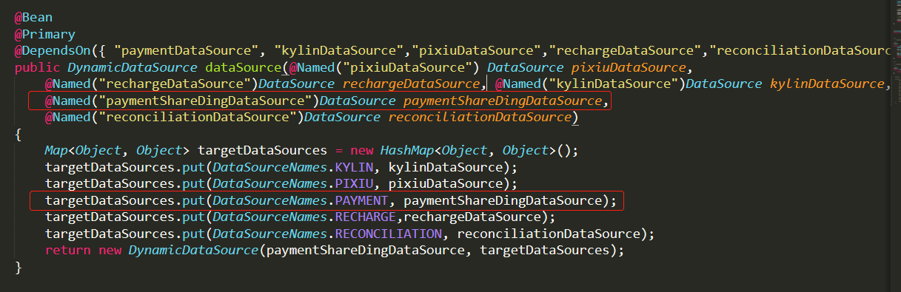

### 简介

​	在项目开发中我们可能会使用多个数据库，不同业务使用不同的数据库，我们可以采用**注解+AOP**的方式来配置多数据源，利用自定义注解来切换数据源。

​	Sharding-JDBC是轻量级Java框架 ，在Java的JDBC层提供的额外服务。 它使用客户端直连数据库，以jar包形式提供服务，无需额外部署和依赖，可理解为增强版的JDBC驱动，完全兼容JDBC和各种ORM框架。 **用来实现分库分表很方便。**

  

### 一、配置多数据源

#### 配置步骤

1. 在application.properties配置数据源url、username、password等等信息

```properties
spring.datasource.druid.kylin.username=
spring.datasource.druid.kylin.password=
spring.datasource.druid.kylin.url=

spring.datasource.druid.pixiu.username=
spring.datasource.druid.pixiu.password=
spring.datasource.druid.pixiu.url=

spring.datasource.druid.payment.username=
spring.datasource.druid.payment.password=
spring.datasource.druid.payment.url=
```

  

2. 定义动态数据源

数据库名字：

```java
public interface DataSourceNames {
    String PIXIU = "pixiu";
    String KYLIN = "kylin";
    String PAYMENT = "payment";
}
```

  

**动态数据源需要继承AbstractRoutingDataSource，并覆盖determineCurrentLookupKey方法**，构造方法中defaultTargetDataSource是默认使用的数据源，targetDataSources保存的是所有的数据源，构造方法的两个参数需要配置注入。`ThreadLocal保存的是当前线程的共享变量，这个是用来保存当前使用的数据源。`

```java
public class DynamicDataSource extends AbstractRoutingDataSource {
	//ThreadLocal 当前线程的共享变量
    private static final ThreadLocal<String> contextHolder = new ThreadLocal<>();

    public DynamicDataSource(DataSource defaultTargetDataSource, Map<Object, Object> targetDataSources) {
        super.setDefaultTargetDataSource(defaultTargetDataSource);
        super.setTargetDataSources(targetDataSources);
        super.afterPropertiesSet();
    }

    @Override
    protected Object determineCurrentLookupKey() {
        return getDataSource();
    }

    public static void setDataSource(String dataSource) {
        contextHolder.set(dataSource);
    }

    public static String getDataSource() {
        return contextHolder.get();
    }

    public static void clearDataSource() {
        contextHolder.remove();
    }

}
```

​    

3. 配置动态数据源，包括各个数据源的注入、根据数据源创建SqlSessionFactory、事务管理器。

```java
@Configuration
public class DynamicDataSourceConfig {

    @Bean(name = "pixiuDataSource")
    @ConfigurationProperties("spring.datasource.druid.pixiu")
    public DataSource pixiuDataSource(){
        return DruidDataSourceBuilder.create().build();
    }

    @Bean(name = "kylinDataSource")
    @ConfigurationProperties("spring.datasource.druid.kylin")
    public DataSource kylinDataSource(){
        return DruidDataSourceBuilder.create().build();
    }

    @Bean(name = "paymentDataSource")
    @ConfigurationProperties("spring.datasource.druid.payment")
    public DataSource paymentDataSource(){
        return DruidDataSourceBuilder.create().build();
    }

   

    @Bean
    @Primary
    @DependsOn({ "paymentDataSource", "kylinDataSource","pixiuDataSource"})   //@DependsOn控制bean初始化顺序
    public DynamicDataSource dataSource(@Named("pixiuDataSource") DataSource pixiuDataSource,@Named("kylinDataSource")DataSource kylinDataSource, @Named("paymentDataSource")DataSource paymentDataSource) {
        Map<Object, Object> targetDataSources = new HashMap<Object, Object>();
        targetDataSources.put(DataSourceNames.KYLIN, kylinDataSource);
        targetDataSources.put(DataSourceNames.PIXIU, pixiuDataSource);
        targetDataSources.put(DataSourceNames.PAYMENT, paymentDataSource);
        //paymentDataSource是默认的数据源，targetDataSources是所有的数据源
        return new DynamicDataSource(paymentDataSource, targetDataSources);
    }
    
    // 获取application.properties的配置
    @Autowired
    private Environment env;

    /**
     * 根据数据源创建SqlSessionFactory
     */
    @Bean
    public SqlSessionFactory sqlSessionFactory(DynamicDataSource ds) throws Exception {
        SqlSessionFactoryBean fb = new SqlSessionFactoryBean();
        fb.setDataSource(ds);  //指定数据源(这个必须有，否则报错)
   // 下边两句仅仅用于*.xml文件，如果整个持久层操作不需要使用到xml文件的话（只用注解就可以搞定），则不加
        fb.setTypeAliasesPackage(env.getProperty("mybatis.type-aliases-package"));// 指定基包
        fb.setMapperLocations(new PathMatchingResourcePatternResolver().getResources(env.getProperty("mybatis.mapper-locations"))); //指定mapper所在位置
        return fb.getObject();
    }
    
    /**
     * 配置事务管理器
     */
    @Bean
    public DataSourceTransactionManagernManager transactionManager(DynamicDataSource ds){
        return new DataSourceTransactionManager(ds);
    }
}

```


  

4. 自定义注解+AOP

自定义注解：

```java
@Target({ElementType.METHOD, ElementType.TYPE})
@Retention(RetentionPolicy.RUNTIME)
@Inherited
@Documented
public @interface DataSource {
    String name() default "";
}
```

  

AOP切入：在哪些类或者方法上扫描@Datasource注解，一般service层会注入mapper来对数据库操作，在Service层切入

```java
@Aspect
@Component
public class DataSourceAspect implements Ordered {
    protected Logger logger = LoggerFactory.getLogger(getClass());

	//Service包下所有的类或方法
    @Pointcut("execution(* fm.lizhi.payment.platform.admin.*.service.*.*(..))")
    public void dataSourcePointCut() {

    }

    @Around("dataSourcePointCut()")
    public Object around(ProceedingJoinPoint point) throws Throwable {
        MethodSignature signature = (MethodSignature) point.getSignature();
        Method method = signature.getMethod();
        DataSource ds = method.getAnnotation(DataSource.class);
        if (ds == null) {
            DynamicDataSource.setDataSource(((DataSource)method.getDeclaringClass().getAnnotation(DataSource.class)).name());
        } else {
            DynamicDataSource.setDataSource(ds.name());
        }

        try {
            return point.proceed();
        } finally {
            DynamicDataSource.clearDataSource();
        }
    }

    @Override
    public int getOrder() {
        return 1;
    }
}
```

  

5. 使用案例，配置name的名字就可以使用指定的数据源了

```java
@Service
@DataSource(name = DataSourceNames.PIXIU)
public class AppChannelService {
	......
}
```


### 二、使用Sharding—JDBC实现分库分表

> 官网：https://shardingsphere.apache.org/document/current/cn/features/


假设payment库里有account_history_1、account_history_2、account_history_3、account_history_4四张表，这四张表的结构是一样的，下面根据表里面的currency字段来分表，比如，当insert记录的时候currency为COIN时插入到1表，currency为LIZHI时插入到2表。


#### 配置步骤

1. 配置Sharding数据源

```java
/*
     *  配置Sharding数据源
     */
    @Bean(name = "paymentShareDingDataSource")
    public DataSource paymentShareDingDataSource(@Named("paymentDataSource")DataSource paymentDataSource) throws SQLException {
        // 配置真实数据源
        Map<String, DataSource> dataSourceMap = new HashMap<>();
        dataSourceMap.put(DataSourceNames.PAYMENT, paymentDataSource);

        // 配置account_history表规则
        TableRuleConfiguration paymentTableRuleConfig = paymentRuleConfig();


        // 配置分片规则
        ShardingRuleConfiguration shardingRuleConfiguration = new ShardingRuleConfiguration();
        shardingRuleConfiguration.getTableRuleConfigs().add(paymentTableRuleConfig);

        DataSource dataSource = ShardingDataSourceFactory.createDataSource(dataSourceMap, shardingRuleConfiguration, new ConcurrentHashMap<>(), new Properties());
        return dataSource;
    }

/**
     * account_history表 分片策略
     * @return
     */
    private TableRuleConfiguration paymentRuleConfig() {
        // 配置user表规则
        TableRuleConfiguration tableRuleConfig = new TableRuleConfiguration();
        String loginName = "account_history";
        tableRuleConfig.setLogicTable(loginName);

        //数据源的名称要和DynamicDataSource中的targetDataSources里面设置的数据源名称相同
        tableRuleConfig.setActualDataNodes(DataSourceNames.PAYMENT + ".account_history_${1..4}");
        tableRuleConfig.setKeyGeneratorColumnName("id");
        tableRuleConfig.setKeyGenerator(new PaymentKeyGenerator()); //设置分布式ID生成器
        // 配置分库 + 分表策略
        //tableRuleConfig.setDatabaseShardingStrategyConfig(new InlineShardingStrategyConfiguration("city_id", "ds${city_id % 2}"));
        tableRuleConfig.setTableShardingStrategyConfig(new StandardShardingStrategyConfiguration("currency",new AccountCommonShardingConfiguration(loginName)));
        return tableRuleConfig;
    }
```


分表策略，**实现PreciseShardingAlgorithm接口并重写doSharding方法**，可以根据业务来定制相应的分表策略。

```java
public class AccountCommonShardingConfiguration implements PreciseShardingAlgorithm {

    private String prefix;

    public AccountCommonShardingConfiguration(String prefix){
        this.prefix = prefix;
    }

    @Override
    public String doSharding(Collection availableTargetNames, PreciseShardingValue shardingValue) {
        String columnValue = "";
        if (shardingValue.getColumnName().equals("account_code")){
            columnValue = shardingValue.getValue().toString().substring(shardingValue.getValue().toString().lastIndexOf('-') + 1);
        } else {
            columnValue = shardingValue.getValue().toString();
        }

        if (columnValue.equals("COIN")||columnValue.equals("COIN_PRODUCT")){
            return this.prefix + "_1";
        } else if (columnValue.equals("LIZHI")){
            return this.prefix + "_2";
        } else {
            byte[] arr = columnValue.getBytes();
            Long temp = 0L;
            for (byte b : arr){
                temp += b;
            }
            return this.prefix + "_" + (3+(temp%2));
        }
    }
}

```


2. 配置完后需要加入到动态数据源中，即把原来未实现分库分表的数据源替换成Sharding数据源。




