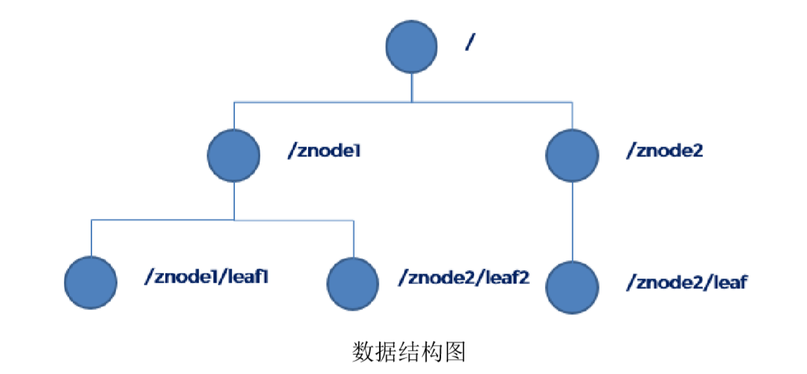
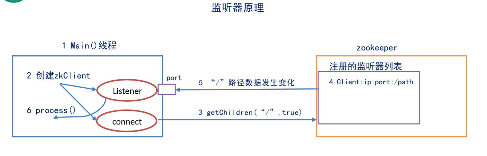
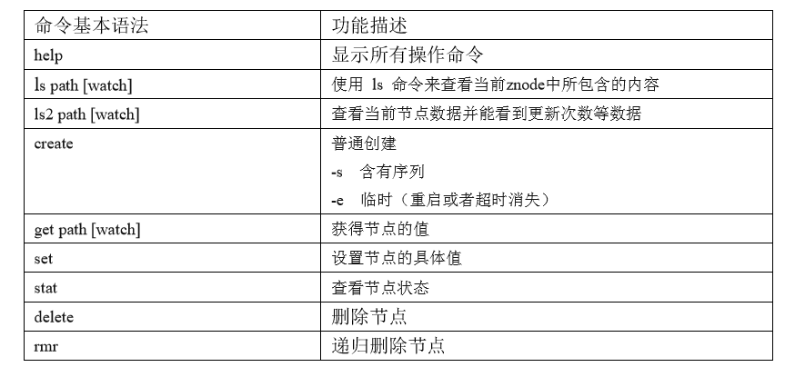

## Zookeeper学习笔记

### 1、概述

#### 1.1、什么是zookeeper

  ZooKeeper 是一种分布式协调服务，用于管理大型主机。在分布式环境中协调和管理服务是一个复杂的过程。ZooKeeper 通过其简单的架构和 API 解决了这个问题。ZooKeeper 允许开发人员专注于核心应用程序逻辑，而不必担心应用程序的分布式特性。

  

#### 1.2、特点

* Zookeeper：一个领导者（leader），多个跟随者（follower）组成的集群。 
* Leader 负责进行投票的发起和决议，更新系统状态 
* Follower 用于接收客户请求并向客户端返回结果，在选举 Leader 过程中参与投票 
* 集群中只要有半数以上节点存活，Zookeeper 集群就能正常服务。 
* 全局数据一致：每个 server 保存一份相同的数据副本，client 无论连接到哪个 server，数
  据都是一致的。 
* 更新请求顺序进行，来自同一个 client 的更新请求按其发送顺序依次执行。 
* 数据更新原子性，一次数据更新要么成功，要么失败。 
* 实时性，在一定时间范围内，client 能读到最新数据

  

#### 1.3、数据结构

  ZooKeeper 数据模型的结构与 Unix 文件系统很类似，整体上可以看作是一棵树，每个节点称做一个 ZNode。 很显然 zookeeper 集群自身维护了一套数据结构。这个存储结构是一个树形结构，其上的每一个节点，我们称之为"znode"，每一个 znode 默认能够存储 1MB 的数据，**每个 ZNode都可以通过其路径唯一标识 **



  

##### ZNode结点结构


- data：Znode 存储的数据信息。
- ACL：记录 Znode 的访问权限，即哪些人或哪些 IP 可以访问本节点。
- stat：包含 Znode 的各种元数据，比如事务 ID、版本号、时间戳、大小等等。
- child：当前节点的子节点引用

  

#### 1.4、应用场景

* 分布式锁 

  这是雅虎研究员设计 Zookeeper 的初衷。利用 Zookeeper 的临时顺序节点，可以轻松实现分布式锁。

* 服务注册与发现

  利用 Znode 和 Watcher，可以实现分布式服务的注册和发现。最著名的应用就是阿里的分布式 RPC 框架 Dubbo。

* 一致性配置管理，获取公共配置等等。

  

### 2、Zookeeper安装

#### 2.1、本地模式安装部署

* 下载并解压

```bash
tar -zxvf zookeeper-3.4.10.tar.gz -C /opt/module/ 
```

* 配置修改

```
(1) 将conf路径下的zoo_sample.cfg修改为zoo.cfg
(2) vim zoo.cfg 修改dataDir路径为：dataDir=/opt/module/zookeeper-3.4.10/zkData 
(3) 在/opt/module/zookeeper-3.4.10/这个目录上创建 zkData 文件夹 
```

* 操作zookeeper

```
(1) 启动zookeeper  在bin目录下  ./zkServer.sh start
(2) 查看进程是否启动：jps
(3) 查看状态：./zkServer.sh status
        ZooKeeper JMX enabled by default 
        Using config: /opt/module/zookeeper-3.4.10/bin/../conf/zoo.cfg 
        Mode: standalone
(4) 启动客户端：./zkCli.sh
(5) 推出客户端： quit
(6) 停止zookeeper：./zkServer.stop
```

  

#### 2.2、配置参数解读

zoo.cfg文件中的参数含义：

* tickTime：通信心跳数，Zookeeper服务器心跳时间，单位毫秒。Zookeeper使用的基本时间，**服务器之间或客户端与服务器之间维持心跳的时间间隔**，也就是每个tickTime时间就会发送一个心跳，时间单位为毫秒。 它用于心跳机制，并且设置最小的session超时时间为两倍心跳时间。(session的最小超时时间是2*tickTime) 
* initLimit：LF初始通信时限。集群中的follower跟随者服务器(F)与leader领导者服务器(L)之间初始连接时能容忍的最多心跳数（tickTime的数量），用它来限定集群中的Zookeeper服务器连接到Leader的时限。Follower在启动过程中，会从Leader同步所有最新数据，然后确定自己能够对外服务的起始状态。 Leader允许F在initLimit时间内完成这个工作。 
* syncLimit：LF 同步通信时限。集群中Leader与Follower之间的最大响应时间单位，假如响应超过syncLimit×tickTime，Leader认为Follwer死掉，从服务器列表中删除Follwer。 在运行过程中，Leader负责与ZK集群中所有机器进行通信，例如通过一些心跳检测机制，来检测机器的存活状态。 如果L发出心跳包在syncLimit之后，还没有从F那收到响应，那么就认为这个F已经不在线了。
* dataDir：**数据文件目录+数据持久化路径**。保存内存数据库快照信息的位置，如果没有其他说明，更新的事务日志也保存到数据库
* clientPort：客户端连接端口。监听客户端连接的端口


#### 2.3、三种工作模式

- 单机模式：存在单点故障
- 集群模式：在多台机器上部署 Zookeeper 集群，适合线上环境使用。
- 伪集群模式：在一台机器同时运行多个 Zookeeper 实例，仍然有单点故障问题，当然，其中配置的端口号要错开的，适合实验环境模拟集群使用。


### 3、zookeeper内部原理

#### 3.1、选举机制

* 半数机制（Paxos 协议）：集群中半数以上机器存活，集群可用。所以 zookeeper适合装在奇数台机器上。 
* Zookeeper 虽然在配置文件中并没有指定 master 和 slave。但是，zookeeper 工作时，是有一个节点为 leader，其他则为 follower，Leader 是通过内部的选举机制临时产生的
* 选举机制的细节待补充。。

  

#### 3.2、节点类型

* 持久节点（PERSISTENT）：默认的节点类型。创建节点的客户端与 Zookeeper 断开连接后，该节点依旧存在。
* 持久节点顺序节点（PERSISTENT_SEQUENTIAL）：所谓顺序节点，就是在创建节点时，Zookeeper 根据创建的时间顺序给该节点名称进行编号
* 临时节点（EPHEMERAL）：和持久节点相反，当创建节点的客户端与 Zookeeper 断开连接后，临时节点会被删除
* 临时顺序节点（EPHEMERAL_SEQUENTIAL）：临时顺序节点结合和临时节点和顺序节点的特点：在创建节点时，Zookeeper 根据创建的时间顺序给该节点名称进行编号；当创建节点的客户端与 Zookeeper 断开连接后，临时节点会被删除。

  

#### 3.3、stat 结构体 

* czxid- 引起这个 znode 创建的 zxid，创建节点的事务的 zxid每次修改 ZooKeeper 状态都会收到一个 zxid 形式的时间戳，也就是 ZooKeeper 事务 ID。事务 ID 是 ZooKeeper 中所有修改总的次序。每个修改都有唯一的 zxid，如果 zxid1 小于 zxid2，那么 zxid1 在 zxid2 之前发生。 
* ctime - znode 被创建的毫秒数(从 1970 年开始) 
* mzxid - znode 最后更新的 zxid 
* mtime - znode 最后修改的毫秒数(从 1970 年开始) 
* pZxid-znode 最后更新的子节点 zxid 
* cversion - znode 子节点变化号，znode 子节点修改次数 
* dataversion - znode 数据变化号 
* aclVersion - znode 访问控制列表的变化号 
* ephemeralOwner- 如果是临时节点，这个是 znode 拥有者的 session id。如果不是临时节
  点则是 0。 
* dataLength- znode 的数据长度 
* numChildren - znode 子节点数量


#### 3.4、监听器原理



##### 3.4.1、原理详解

1）首先要有一个 main()线程 
2）在 main 线程中创建 Zookeeper 客户端，这时就会创建两个线程，一个负责网络连接
通信（connet），一个负责监听（listener）。 
3）通过 connect 线程将注册的监听事件发送给 Zookeeper。 
4）在 Zookeeper 的注册监听器列表中将注册的监听事件添加到列表中。 
5）Zookeeper 监听到有数据或路径变化，就会将这个消息发送给 listener 线程。 
6）listener 线程内部调用了 process（）方法

##### 3.4.2、常见的监听 

1）监听节点数据的变化： 

`get path [watch] `
2）监听子节点增减的变化 
`ls path [watch] `


#### 3.5、写数据流程

ZooKeeper 的写数据流程主要分为以下几步

1. 比如 Client 向 ZooKeeper 的 Server1 上写数据，发送一个写请求。 
2. 如果 Server1 不是 Leader，那么 Server1 会把接受到的请求进一步转发给 Leader，因
   为每个 ZooKeeper 的 Server 里面有一个是 Leader。这个 Leader 会将写请求广播给各个
   Server，比如 Server1 和 Server2， 各个 Server 写成功后就会通知 Leader。 
3. 当 Leader 收到大多数 Server 数据写成功了，那么就说明数据写成功了。如果这里
   三个节点的话，只要有两个节点数据写成功了，那么就认为数据写成功了。写成功之后，
   Leader 会告诉 Server1 数据写成功了。 
4. Server1 会进一步通知 Client 数据写成功了，这时就认为整个写操作成功。


### 4、Zookeeper集群

#### 4.1、分布式安装部署

* 按步骤2.1安装好单机环境
* 配置zoo.cfg环境

```
增加如下配置 
##############cluster############
server.1=192.168.196.101:2888:3888 
server.2=192.168.196.102:2888:3888 
server.3=192.168.196.103:2888:3888 
```

```配置参数解读
Server.A=B:C:D。 
A 是一个数字，表示这个是第几号服务器； 
B 是这个服务器的 ip 地址； 
C 是这个服务器与集群中的 Leader 服务器交换信息的端口； 
D 是万一集群中的 Leader 服务器挂了，需要一个端口来重新进行选举，选出一个新的
Leader，而这个端口就是用来执行选举时服务器相互通信的端口。
```

* 集群操作

```
集群模式下配置一个文件myid，这个文件在dataDir目录下，这个文件里面有一个数据就是 A 的值，Zookeeper 启动时读取此文件，拿到里面的数据与 zoo.cfg 里面的配置信息比较从而判断到底是哪个 server。 
```

```
（1）在/opt/module/zookeeper-3.4.10/zkData 目录下创建一个 myid 的文件 
 touch myid 
添加 myid 文件，注意一定要在 linux 里面创建，在 notepad++里面很可能乱码 

（2）编辑 myid 文件 
 vi myid 
 在文件中添加与 server 对应的编号：如 1
 
（3）在其他机器上相同配置
 并分别修改 myid 文件中内容为 2、3
 
（4）分别启动 zookeeper 
[root@101 zookeeper-3.4.10]# bin/zkServer.sh start 
[root@102 zookeeper-3.4.10]# bin/zkServer.sh start 
[root@103 zookeeper-3.4.10]# bin/zkServer.sh start 

（5）查看状态
[root@103 zookeeper-3.4.10]# bin/zkServer.sh status
观察Mode ---》 leader、follower
```


#### 4.2、客户端命令行操作



