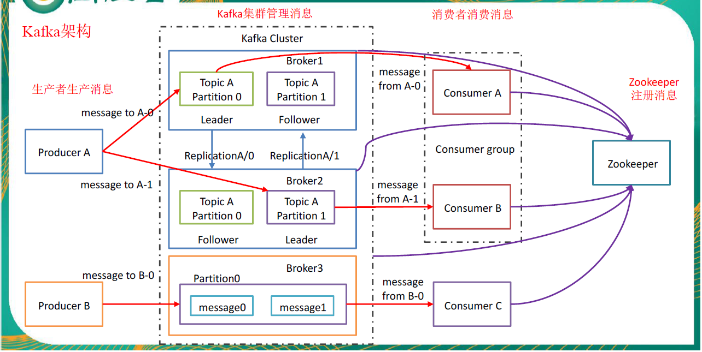

### 消息队列（Message Queue）

#### 1、为什么要使用MQ？有什么优缺点？

优点：解耦、异步、削峰

缺点：系统可用性降低、系统复杂度提高、数据一致性问题

参考：<https://github.com/scauzns/advanced-java/blob/master/docs/high-concurrency/why-mq.md>

 

#### 2、如何保证消息队列的高可用？

Kafka 0.8 以后，提供了 HA 机制，就是 replica（复制品） 副本机制。每个 partition 的数据都会同步到其它机器上，形成自己的多个 replica 副本。所有 replica 会选举一个 leader 出来，那么生产和消费都跟这个 leader 打交道，然后其他 replica 就是 follower。写的时候，leader 会负责把数据同步到所有 follower 上去，读的时候就直接读 leader 上的数据即可。

因为如果某个 broker 宕机了，那个 broker上面的 partition 在其他机器上都有副本的。如果这个宕机的 broker 上面有某个 partition 的 leader，那么此时会从 follower 中**重新选举**一个新的 leader 出来，大家继续读写那个新的 leader 即可。这就有所谓的高可用性了。

**写数据**的时候，生产者就写 leader，然后 leader 将数据落地写本地磁盘，接着其他 follower 自己主动从 leader 来 pull 数据。一旦所有 follower 同步好数据了，就会发送 ack 给 leader，leader 收到所有 follower 的 ack 之后，就会返回写成功的消息给生产者。（当然，这只是其中一种模式，还可以适当调整这个行为）

**消费**的时候，只会从 leader 去读，但是只有当一个消息已经被所有 follower 都同步成功返回 ack 的时候，这个消息才会被消费者读到。

 

#### 3、如何保证消息不被重复消费？（消息消费的幂等性）

需要结合具体的业务来分析

- 比如你拿个数据要写库，你先根据主键查一下，如果这数据都有了，你就别插入了，update 一下好吧。
- 比如你是写 Redis，那没问题了，反正每次都是 set，天然幂等性。
- 比如你不是上面两个场景，那做的稍微复杂一点，你需要让生产者发送每条数据的时候，里面加一个全局唯一的 id，类似订单 id 之类的东西，然后你这里消费到了之后，先根据这个 id 去比如 Redis 里查一下，之前消费过吗？如果没有消费过，你就处理，然后这个 id 写 Redis。如果消费过了，那你就别处理了，保证别重复处理相同的消息即可。
- 比如基于数据库的唯一索引来保证重复数据不会重复插入多条。因为有唯一键约束了，重复数据插入只会报错，不会导致数据库中出现脏数据。

 

#### 4、如何保证消息的可靠性传输？（消息丢失的问题）

**消费端弄丢了数据**

唯一可能导致消费者弄丢数据的情况，就是说，你消费到了这个消息，然后消费者那边**自动提交了 offset**，让 Kafka 以为你已经消费好了这个消息，但其实你才刚准备处理这个消息，你还没处理，你自己就挂了，此时这条消息就丢咯。

Kafka 会自动提交 offset，那么只要**关闭自动提交** offset，在处理完之后自己手动提交 offset，就可以保证数据不会丢。但是此时确实还是**可能会有重复消费**，比如你刚处理完，还没提交 offset，结果自己挂了，此时肯定会重复消费一次，自己保证幂等性就好了。

生产环境碰到的一个问题，就是说我们的 Kafka 消费者消费到了数据之后是写到一个内存的 queue 里先缓冲一下，结果有的时候，你刚把消息写入内存 queue，然后消费者会自动提交 offset。然后此时我们重启了系统，就会导致内存 queue 里还没来得及处理的数据就丢失了。

**kafka弄丢了数据**

这块比较常见的一个场景，就是 Kafka 某个 broker 宕机，然后重新选举 partition 的 leader。大家想想，要是此时其他的 follower刚好还有些数据没有同步，结果此时 leader 挂了，然后选举某个 follower 成 leader 之后，少了一些数据。

此时一般是要求起码设置如下 4 个参数：

- 给 topic 设置 `replication.factor` 参数：这个值必须大于 1，要求每个 partition 必须有至少 2 个副本。
- 在 Kafka 服务端设置 `min.insync.replicas` 参数：这个值必须大于 1，这个是要求一个 leader 至少感知到有至少一个 follower 还跟自己保持联系，没掉队，这样才能确保 leader 挂了还有一个 follower 吧。
- 在 producer 端设置 `acks=all` ：这个是要求每条数据，必须是**写入所有 replica 之后，才能认为是写成功了**。
- 在 producer 端设置 `retries=MAX` （很大很大很大的一个值，无限次重试的意思）：这个是**要求一旦写入失败，就无限重试**，卡在这里了。

这样配置之后，至少在 Kafka broker 端就可以保证在 leader 所在 broker 发生故障，进行 leader 切换时，数据不会丢失。

**生产者弄丢了数据**

如果按照上述的思路设置了 `acks=all` ，一定不会丢，要求是，你的 leader 接收到消息，所有的 follower 都同步到了消息之后，才认为本次写成功了。如果没满足这个条件，生产者会自动不断的重试，重试无限次。

 

#### 5、消息堆积怎么处理？

**大量消息在 mq 里积压了几个小时了还没解决**

几千万条数据在 MQ 里积压了七八个小时，从下午 4 点多，积压到了晚上 11 点多。这个是我们真实遇到过的一个场景，确实是线上故障了，这个时候要不然就是修复 consumer 的问题，让它恢复消费速度，然后傻傻的等待几个小时消费完毕。这个肯定不能在面试的时候说吧。

一个消费者一秒是 1000 条，一秒 3 个消费者是 3000 条，一分钟就是 18 万条。所以如果你积压了几百万到上千万的数据，即使消费者恢复了，也需要大概 1 小时的时间才能恢复过来。

一般这个时候，只能临时紧急扩容了，具体操作步骤和思路如下：

- 先修复 consumer 的问题，确保其恢复消费速度，然后将现有 consumer 都停掉。
- 新建一个 topic，partition 是原来的 10 倍，临时建立好原先 10 倍的 queue 数量。
- 然后写一个临时的分发数据的 consumer 程序，这个程序部署上去消费积压的数据，**消费之后不做耗时的处理**，直接均匀轮询写入临时建立好的 10 倍数量的 queue。
- 接着临时征用 10 倍的机器来部署 consumer，每一批 consumer 消费一个临时 queue 的数据。这种做法相当于是临时将 queue 资源和 consumer 资源扩大 10 倍，以正常的 10 倍速度来消费数据。
- 等快速消费完积压数据之后，**得恢复原先部署的架构**，**重新**用原先的 consumer 机器来消费消息。