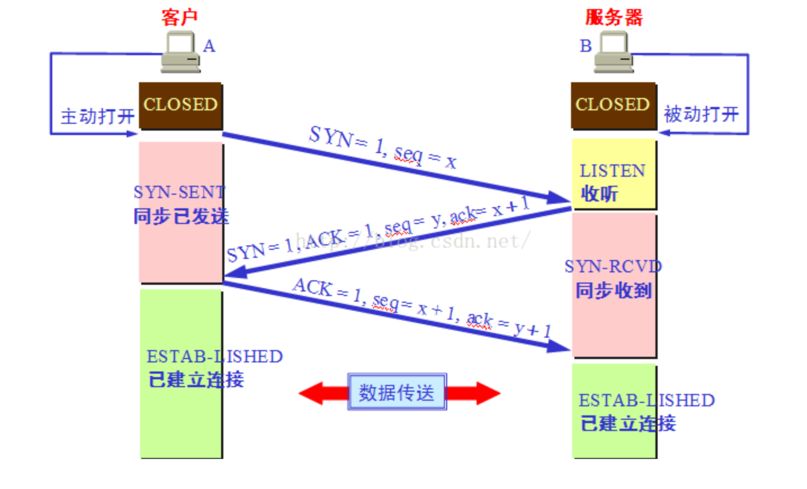
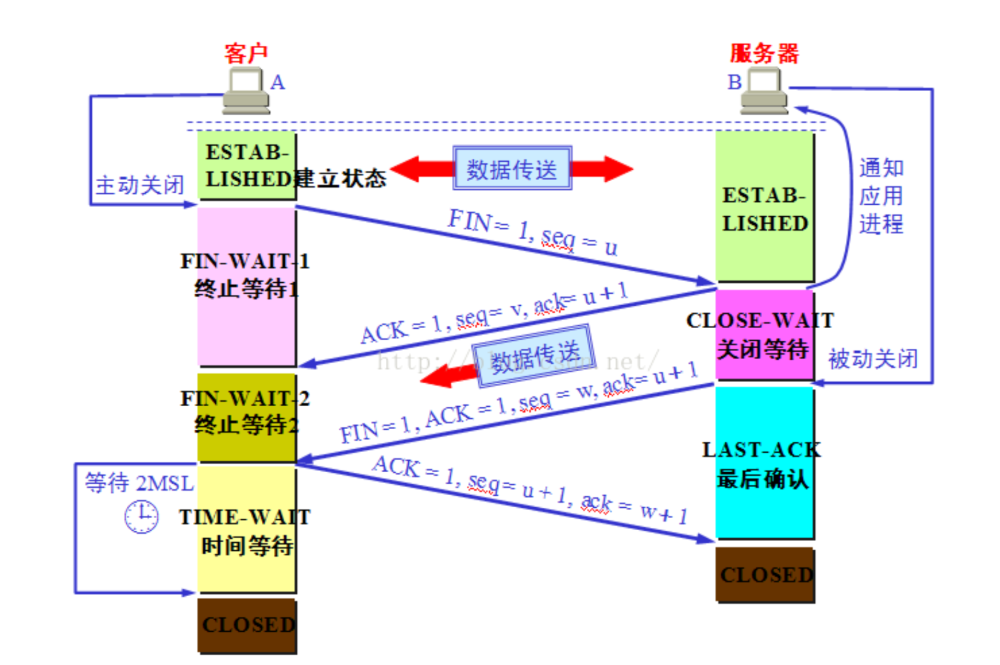
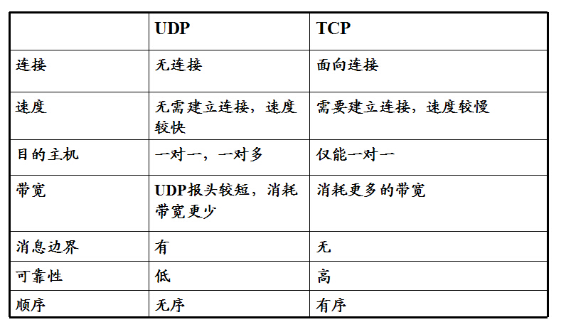
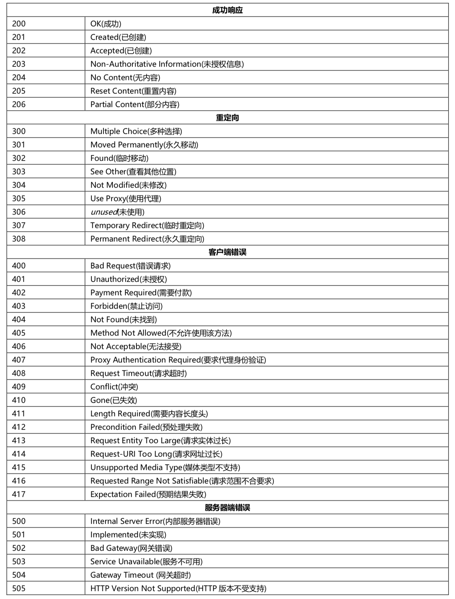
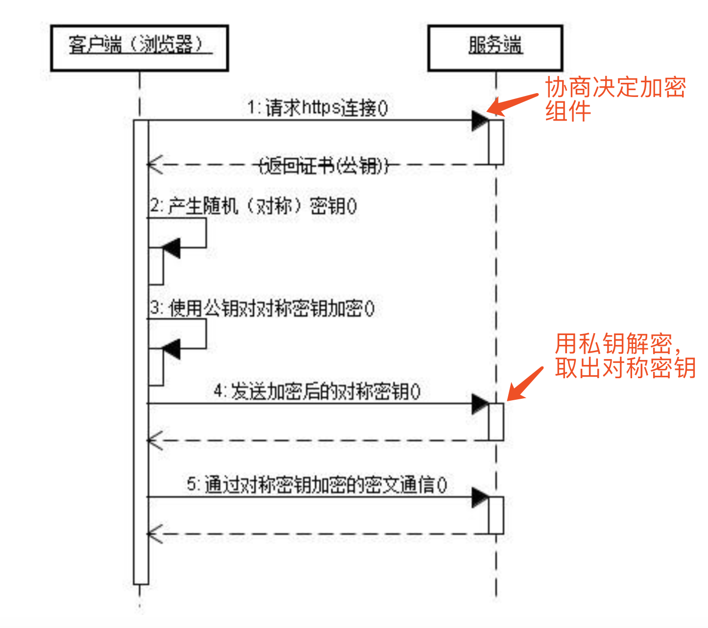
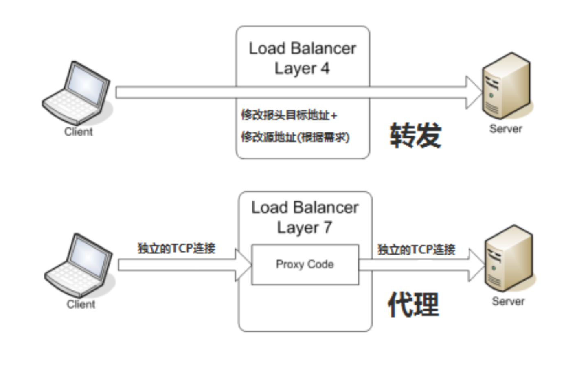

### 1. 网络体系结构


学习计算机网络时我们一般采用折中的办法，也就是中和 OSI 和 TCP/IP 的优点，采用一种只有五层协议的体系结构，这样既简洁又能将概念阐述清楚。

各层的作用：

#### 1.1 应用层

​    应用层(application-layer）的任务是通过应用进程间的交互来完成特定网络应用。应用层协议定义的是应用进程（进程：主机中正在运行的程序）间的通信和交互的规则。对于不同的网络应用需要不同的应用层协议。在互联网中应用层协议很多，如域名系统DNS，支持万维网应用的 HTTP协议，支持电子邮件的 SMTP协议等等。我们把应用层交互的数据单元称为报文。

#### 1.2 传输层

​	运输层(transport layer)的主要任务就是负责向两台主机进程之间的通信提供通用的数据传输服务。应用进程利用该服务传送应用层报文。“通用的”是指并不针对某一个特定的网络应用，而是多种应用可以使用同一个运输层服务。由于一台主机可同时运行多个线程，因此运输层有复用和分用的功能。所谓复用就是指多个应用层进程可同时使用下面运输层的服务，分用和复用相反，是运输层把收到的信息分别交付上面应用层中的相应进程。

##### 1.2.1. 传输层主要使用两种协议

1. 传输控制协议 TCP（Transmission Control Protocol）--提供面向连接的，可靠的数据传输服务。
2. 用户数据协议 UDP（User Datagram Protocol）--提供无连接的，尽最大努力的数据传输服务（不保证数据传输的可靠性）。

##### 1.2.2. UDP 的主要特点

1. UDP 是无连接的；
2. UDP 使用尽最大努力交付，即不保证可靠交付，因此主机不需要维持复杂的链接状态（这里面有许多参数）；
3. UDP 是面向报文的；
4. UDP 没有拥塞控制，因此网络出现拥塞不会使源主机的发送速率降低（对实时应用很有用，如 直播，实时视频会议等）；
5. UDP 支持一对一、一对多、多对一和多对多的交互通信；
6. UDP 的首部开销小，只有8个字节，比TCP的20个字节的首部要短。

##### 1.2.3 TCP 的主要特点

1. TCP 是面向连接的。（就好像打电话一样，通话前需要先拨号建立连接，通话结束后要挂机释放连接）；
2. 每一条 TCP 连接只能有两个端点，每一条TCP连接只能是点对点的（一对一）；
3. TCP 提供可靠交付的服务。通过TCP连接传送的数据，无差错、不丢失、不重复、并且按序到达；
4. TCP 提供全双工通信。TCP 允许通信双方的应用进程在任何时候都能发送数据。TCP 连接的两端都设有发送缓存和接收缓存，用来临时存放双方通信的数据；
5. 面向字节流。TCP 中的“流”（Stream）指的是流入进程或从进程流出的字节序列。“面向字节流”的含义是：虽然应用程序和 TCP 的交互是一次一个数据块（大小不等），但 TCP 把应用程序交下来的数据仅仅看成是一连串的无结构的字节流。


#### 1.3 网络层

​	在 计算机网络中进行通信的两个计算机之间可能会经过很多个数据链路，也可能还要经过很多通信子网。网络层的任务就是选择合适的网间路由和交换结点， 确保数据及时传送。在发送数据时，网络层把运输层产生的报文段或用户数据报封装成分组和包进行传送。在 TCP/IP 体系结构中，由于网络层使用 **IP 协议**，因此分组也叫 **IP 数据报** ，简称 **数据报**。互联网是由大量的异构（heterogeneous）网络通过路由器（router）相互连接起来的。互联网使用的网络层协议是无连接的网际协议（Intert Protocol）和许多路由选择协议，因此互联网的网络层也叫做**网际层**或**IP层**。


#### 1.4 数据链路层

  数据链路层(data link layer)通常简称为链路层。两台主机之间的数据传输，总是在一段一段的链路上传送的，这就需要使用专门的链路层的协议。在两个相邻节点之间传送数据时，**数据链路层将网络层交下来的 IP 数据报组装程帧**，在两个相邻节点间的链路上传送帧。每一帧包括数据和必要的控制信息（如同步信息，地址信息，差错控制等）。在接收数据时，控制信息使接收端能够知道一个帧从哪个比特开始和到哪个比特结束。这样，数据链路层在收到一个帧后，就可从中提出数据部分，上交给网络层。 控制信息还使接收端能够检测到所收到的帧中有误差错。如果发现差错，数据链路层就简单地丢弃这个出了差错的帧，以避免继续在网络中传送下去白白浪费网络资源。如果需要改正数据在链路层传输时出现差错（这就是说，数据链路层不仅要检错，而且还要纠错），那么就要采用可靠性传输协议来纠正出现的差错。这种方法会使链路层的协议复杂些。


#### 1.5 物理层

在物理层上所传送的数据单位是比特。 **物理层(physical layer)的作用是实现相邻计算机节点之间比特流的透明传送，尽可能屏蔽掉具体传输介质和物理设备的差异。** 使其上面的数据链路层不必考虑网络的具体传输介质是什么。“透明传送比特流”表示经实际电路传送后的比特流没有发生变化，对传送的比特流来说，这个电路好像是看不见的。


附上一张七层体系结构总结图：


### 2. TCP三次握手与四次挥手

#### 2.1. 三次握手



##### 2.1.1. 过程

第一次握手: 主机 A 发送位码为 SYN=1,随机产生 seq number=1234567 的数据包到服务器，主机 B由 SYN=1 知道，A 要求建立联机; （**SYN=1**）
第二次握手: 主机 B 收到请求后要确认联机信息，向 A 发送 ack number=(主机 A 的seq+1),SYN=1,ACK=1,随机产生 seq=7654321 的包（**SYN=1、ACK=1**）
第三次握手: 主机 A 收到后检查 ack number 是否正确，即第一次发送的 seq number+1,以及位码ack 是否为 1，若正确，主机 A 会再发送 ack number=(主机 B 的 seq+1)，ACK=1，主机 B 收到后确认seq 值与 ack=1 则连接建立成功。（**ACK=1**）


#### 2.2. 四次握手



##### 2.2.1. 过程

1. 客户端-发送一个 FIN，用来关闭客户端到服务器的数据传送 (**FIN=1**)

2. 服务器-收到这个 FIN，它发回一个ACK，确认序号为收到的序号加1 。和 SYN 一样，一个 FIN 将占用一个序号 (**ACK=1**)

3. 服务器-关闭与客户端的连接，发送一个FIN给客户端 (**FIN=1**)

4. 客户端-发回 ACK 报文确认，并将确认序号设置为收到序号加1 (**ACK=1**)


##### 2.2.2.  为什么要等2MSL？

1. **为了保证A发送的最后一个ACK报文能够到达B**。这个ACK报文段有可能丢失，因而使处在LAST-ACK状态的B收不到对已发送的FIN+ACK报文段的确认。B会超时重传这个FIN+ACK报文段，而A就能在2MSL时间内收到这个重传的FIN+ACK报文段。如果A在TIME-WAIT状态不等待一段时间，而是在发送完ACK报文段后就立即释放连接，就无法收到B重传的FIN+ACK报文段，因而也不会再发送一次确认报文段。这样，B就无法按照正常的步骤进入CLOSED状态。
2. A在发送完ACK报文段后，再经过2MSL时间，就可以**使本连接持续的时间所产生的所有报文段都从网络中消失。这样就可以使下一个新的连接中不会出现这种旧的连接请求的报文段**。


### 3. TCP、UDP协议的区别



​	UDP 在传送数据之前不需要先建立连接，远地主机在收到 UDP 报文后，不需要给出任何确认。虽然 UDP 不提供可靠交付，但在某些情况下 UDP 确是一种最有效的工作方式（一般用于即时通信），比如： QQ 语音、 QQ 视频 、直播等等。

​	TCP 提供面向连接的服务。在传送数据之前必须先建立连接，数据传送结束后要释放连接。 TCP 不提供广播或多播服务。由于 TCP 要提供可靠的，面向连接的运输服务（TCP的可靠体现在TCP在传递数据之前，会有三次握手来建立连接，而且在数据传递时，有确认、窗口、重传、拥塞控制机制，在数据传完后，还会断开连接用来节约系统资源），这一难以避免增加了许多开销，如确认，流量控制，计时器以及连接管理等。这不仅使协议数据单元的首部增大很多，还要占用许多处理机资源。TCP 一般用于文件传输、发送和接收邮件、远程登录等场景。


### 4. TCP协议可靠传输、流量控制、拥塞避免

#### 4.1. 可靠传输

* 停止等待协议：每发送完一个分组就停止发送，等待对方的确认。在收到确认后再发送下一个分组
* 连续ARQ协议：连续 ARQ 协议可提高信道利用率。发送方维持一个发送窗口，凡位于发送窗口内的分组可以连续发送出去，而不需要等待对方确认。接收方一般采用**累计确认**，**对按序到达的最后一个分组发送确认**，表明到这个分组为止的所有分组都已经正确收到了。缺点是，如果发送方发送了前5个分组，而中间的第3个分组丢失了。这时接收方只能对前两个分组发出确认。发送发无法知道后面三个分组的下落，而只好把后面的三个分组都再重传一次，，也叫Go-back-N（回退N），表示需要再退回来重传已发送过的N个分组。可见当通信线路质量不好时，连续ARQ协议会带来负面的影响。
* 选择确认SACK：只重传未接收的分组

#### 4.2. 流量控制

* 利用滑动窗口协议，接收方**动态调整接收窗口的大小**，可以让发送方的发送速率不要太快，要让接收方来得及接收
* 发送方的发送窗口不能超过接收方给出的接收窗口的数值。请注意，TCP的窗口单位是字节，不是报文段
* Nagle算法：当到达的数据已达到发送窗口大小的一半或已达到报文段的最大长度时，就立即发送一个报文段。这样做可以有效提高网络的吞吐量，但是会出现TCP粘包。

#### 4.3. 拥塞避免

- 慢开始：先探测一下，即由小到大逐渐增大发送窗口，也就是由小到大逐渐增大拥塞窗口数值。cwnd初始值为1，每经过一个传播轮次，cwnd加倍。
- 拥塞避免：拥塞避免算法的思路是让拥塞窗口cwnd缓慢增大，即每经过一个往返时间RTT就把发送放的cwnd加1
- 快重传：如果发送机接收到三个重复确认（3ack），它会假定确认件指出的数据段丢失了，并立即重传这些丢失的数据段，不用等捎带确认。
- 快恢复：发送方收到三个重复确认后，知道丢失了分组，不会重新继续执行慢开始。


### 5. HTTP 和 HTTPS

#### 5.1. HTTP

##### 5.1.1. 常见状态码




##### 5.1.2. 访问一个网页整个过程？

* DNS解析
* 建立TCP连接
* 发送HTTP请求
* 服务器处理请求并返回HTTP报文
* 浏览器解析渲染页面
* 释放连接


##### 5.1.3. HTTP长连接、短连接

在HTTP/1.0中默认使用短连接。也就是说，客户端和服务器每进行一次HTTP操作，就建立一次连接，任务结束就中断连接。当客户端浏览器访问的某个HTML或其他类型的Web页中包含有其他的Web资源（如JavaScript文件、图像文件、CSS文件等），每遇到这样一个Web资源，浏览器就会重新建立一个HTTP会话。

而从HTTP/1.1起，默认使用长连接，用以保持连接特性。使用长连接的HTTP协议，会在响应头加入这行代码：

```http
Connection:keep-alive
```

在使用长连接的情况下，当一个网页打开完成后，客户端和服务器之间用于传输HTTP数据的TCP连接不会关闭，客户端再次访问这个服务器时，会继续使用这一条已经建立的连接。Keep-Alive不会永久保持连接，它有一个保持时间，可以在不同的服务器软件（如Apache）中设定这个时间。实现长连接需要客户端和服务端都支持长连接。

**HTTP协议的长连接和短连接，实质上是TCP协议的长连接和短连接**.


#### 5.2. HTTPS

* 在HTTP基础下加入SSL层，HTTPS的安全基础是SSL，其所用的端口是443
* 使用混合加密机制（公开密钥加密+共享密钥加密）

##### 5.2.1 安全通信机制：



#### 5.3. HTTP2.0 对比 HTTP 1.1的优势在哪里？

* **二进制传输**：采用二进制格式传输数据，而非http1.1文本格式，二进制格式在协议的解析和优化扩展上带来了跟多的优势和可能
* **首部压缩**：对消息头采用Hpack进行压缩传输，能够节省消息头占用的网络流量，http1.1每次请求，都会携带大量冗余的头信息，浪费了很多宽带资源。
* **异步连接多路复用**：允许同时通过单一的 HTTP/2 连接发起多重的请求-响应消息。
* **服务端推送**：Server Push，服务器端能够更快的把资源推送到客户端


### 6. 负载均衡

#### 6.1 四层负载均衡 vs 七层负载均衡

四层工作在OSI第四层，也就是传输层；七层工作在最高层，也就是应用层

##### 

##### 6.1.1 从技术实现原理上

所谓四层负载均衡就是使用**IP加端口**的方式进行路由转发；七层负载均衡一般是基于请求URL地址的方式进行代理转发。同理，还有基于MAC地址信息(虚拟MAC地址到真实MAC地址)进行转发的二层负载均衡和基于IP地址(虚拟IP到真实IP)的三层负载均衡。

四层负载均衡具体实现方式为：通过报文中的IP地址和端口，再加上负载均衡设备所采用的负载均衡算法，最终确定选择后端哪台下游服务器。以TCP为例，客户端向负载均衡发送SYN请求建立第一次连接，通过配置的负载均衡算法选择一台后端服务器，并且将报文中的IP地址信息修改为后台服务器的IP地址信息，因此**TCP三次握手连接是与后端服务器直接建立起来的。**负载均衡设备只是起到一个类 似路由器的转发动作。在某些部署情况下，为保证服务器回包可以正确返回给负载均衡设备，在 转发报文的同时可能还会对报文原来的源地址进行修改。

所谓七层负载均衡，也称为“内容交换”，也就是主要通过报文中的真正有意义的应用层内容， 再加上负载均衡设备设置的服务器选择方式，决定最终选择的内部服务器。七层应用负载的好处，是使得整个网络更智能化。例如访问一个网站的用户流量，可以通过七层 的方式，将对图片类的请求转发到特定的图片服务器并可以使用缓存技术;将对文字类的请求可 以转发到特定的文字服务器并可以使用压缩技术。七层服务均衡在应用层选择服务器，只能先与负载均衡设备进行TCP连接，**然后负载均衡设备再与后端服务器建立另外一条TCP连接通道**。因此，七层设备在网络性能损耗会更多一些。


##### **6.1.2 从安全视角上**

四层负载均衡与服务器直接建立起TCP连接，很容易遭受SYN Flood攻击。SYN Flood是一种广为人知的DDoS（分布式拒绝服务攻击）的方式之一，这是一种利用TCP协议缺陷，发送大量伪造的TCP连接请求，从而使得被攻击方资源耗尽的攻击方式。从技术实现原理上可以看出，四层负载均衡很容易将垃圾流量转发至后台服务器，而七层设备则可以过滤这些恶意并清洗这些流量，但要求设备本身具备很强的抗DDOS流量的能力。


#### 6.2 负载均衡策略

##### 6.2.1 轮循均衡(RoundRobin)

​	每一次来自网络的请求轮流分配给内部中的服务器，从1至N然后重新开始。此种均衡算法适合 于服务器组中的所有服务器都有相同的软硬件配置并且平均服务请求相对均衡的情况。

##### 6.2.2 权重轮循均衡(WeightedRoundRobin)

​	**根据服务器的不同处理能力，给每个服务器分配不同的权值，使其能够接受相应权值数的服务请求。**例如:服务器 A 的权值被设计成 1，B 的权值是 3，C 的权值是 6，则服务器 A、B、C 将分 别接受到 10%、30%、60%的服务请求。此种均衡算法能确保高性能的服务器得到更多的使用 率，避免低性能的服务器负载过重。

##### 6.2.3 随机均衡(Random)

​	把来自网络的请求随机分配给内部中的多个服务器。

##### 6.2.4 响应速度均衡（Response Time 探测时间）

​	负载均衡设备对内部各服务器发出一个探测请求(例如 Ping)，然后**根据内部中各服务器对探测 请求的最快响应时间来决定哪一台服务器来响应客户端的服务请求。**此种均衡算法能较好的反映 服务器的当前运行状态，但这最快响应时间仅仅指的是负载均衡设备与服务器间的最快响应时 间，而不是客户端与服务器间的最快响应时间。

##### 6.2.5 最少连接数均衡（LeastConnection）

​	最少连接数均衡算法对内部中需负载的每一台服务器都有一个数据记录，记录当前该服务器**正在 处理的连接数量**，当有新的服务连接请求时，将把当前请求分配给连接数最少的服务器，使均衡 更加符合实际情况，负载更加均衡。此种均衡算法适合长时处理的请求服务，如 FTP。

##### 6.2.6 处理能力均衡(CPU、内存)

​	此种均衡算法将把服务请求分配给内部中**处理负荷最轻**的服务器(根据服务器 CPU 型号、CPU 数量、内存大小 及当前连接数等换算而成)，由于考虑到了内部服务器的处理能力及当前网络运行 状况，所以此种均衡算法相对来说更加精确，尤其适合运用到第七层(应用层)负载均衡的情况下。

##### 6.2.7 DNS响应均衡(Flash DNS)

​	在此均衡算法下，分处在不同地理位置的负载均衡设备收到同一个客户端的域名解析请求，并在 同一时间内把此域名解析成各自相对应服务器的 IP 地址并返回给客户端，则客户端将以最先收到 的域名解析 IP 地址来继续请求服务，而忽略其它的 IP 地址响应。在种均衡策略适合应用在全局负 载均衡的情况下，对本地负载均衡是没有意义的。

##### 6.2.8 哈希算法

​	一致性哈希一致性 Hash，相同参数的请求总是发到同一提供者。当某一台提供者挂时，原本发往 该提供者的请求，基于虚拟节点，平摊到其它提供者，不会引起剧烈变动。

##### 6.2.9 IP地址散列 (保证客户端服务器对应关系稳定)

​	通过管理发送方 IP 和目的地 IP 地址的散列，将来自同一发送方的分组(或发送至同一目的地的分 组)统一转发到相同服务器的算法。当客户端有一系列业务需要处理而必须和一个服务器反复通信 时，该算法能够以流(会话)为单位，保证来自相同客户端的通信能够一直在同一服务器中进行处 理。

##### 6.2.10 URL散列

​	通过管理客户端请求 URL 信息的散列，将发送至相同 URL 的请求转发至同一服务器的算法。